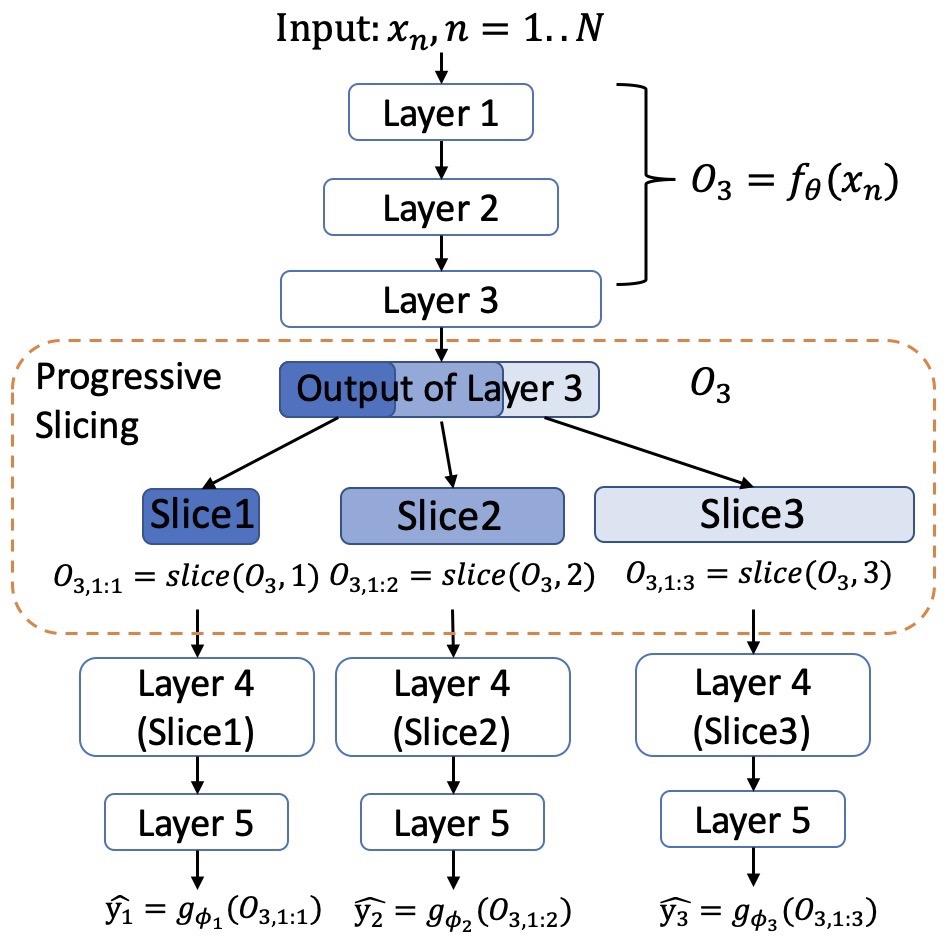

# CLIO: Enabling automatic compilation of deep learning pipelines across IoT and Cloud

This is the repo for CLIO: Enabling automatic compilation of deep learning pipelines across IoT and Cloud. 

# Usage
You can find the usage of CLIO in training.md.

